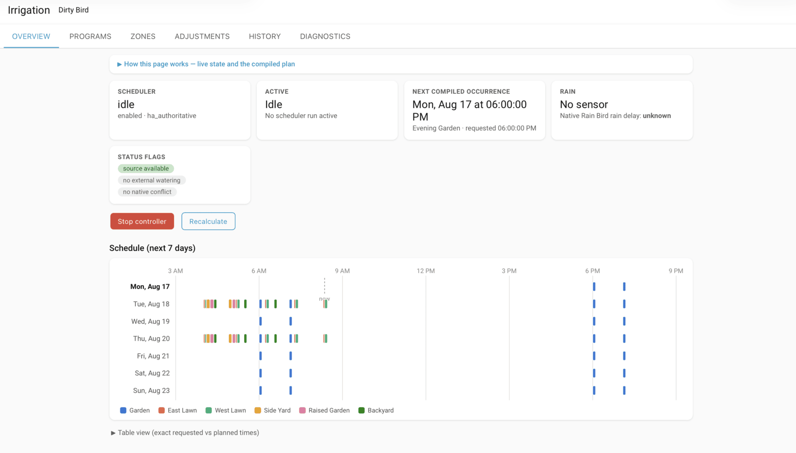
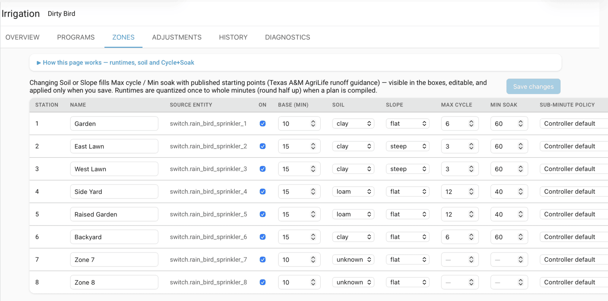

<h1 align="center">Rain Bird Scheduler</h1>

<p align="center">
  <b>A real irrigation scheduler for Home Assistant, built on top of the core <code>rainbird</code> integration.</b><br>
  Describe watering <i>intent</i> — days, start times, per-zone minutes — and it compiles a deterministic,
  one-zone-at-a-time plan your LNK controller can actually execute.
</p>

<p align="center">
  <a href="https://github.com/hacs/integration"></a>
  
  <a href="https://github.com/jgassens/RainBirdScheduler/actions/workflows/ci.yml"></a>
  
  <a href="LICENSE"></a>
</p>



> **Status: version 1 implemented, pre-release.** The integration, panel, and
> test suite are complete and the full design is in
> [docs/PROJECT_PLAN.md](docs/PROJECT_PLAN.md). Hardware validation (plan §43)
> against real LNK/LNK2 controllers is still pending.

## Why this exists

The core [`rainbird`](https://www.home-assistant.io/integrations/rainbird)
integration can start one zone, stop the controller, and report state — but it
has no scheduling. Rain Bird LNK controllers accept one request at a time and
water one zone at a time, so "water these three zones at 9 AM" is not something
you can simply ask for.

This integration lets you describe the intent:

```text
Program: Morning Lawn
Days: Monday, Wednesday, Saturday
Requested start: 9:00 AM
Front lawn       12 min
Side lawn         8 min
Back lawn        15 min
```

All three zones share one requested start. The planner compiles that into a
valid, non-overlapping execution plan:

```text
Front lawn     9:00:00–9:12:00
Side lawn      9:12:05–9:20:05
Back lawn      9:20:10–9:35:10
```

The UI never blurs the distinction between requested start, planned start,
observed start, base runtime, adjusted runtime, controller-quantized runtime,
and the reason for any delay, skip, or adjustment.

## Features

- **Programs and recurrence** — weekdays, odd/even calendar days,
  every-N-days, multiple start times per day, watering windows, explicit DST
  rules.
- **Automatic serialization** — overlapping requested starts are compiled into
  a non-overlapping plan with deliberate inter-zone gaps.
- **Cycle+Soak** — quantized cycle allocation with soak intervals interleaved
  across zones, seeded by published soil and slope guidance.
- **Runtime adjustment** — fixed, manual percentage, monthly curve, automatic
  seasonal (nearest-city ETo curve), or any Home Assistant entity as the
  source. Every calculation shows its full provenance; no black box.
- **Journaled execution** — a persisted state machine that survives Home
  Assistant restarts without ever double-starting a zone.
- **Rain handling** — the native rain delay is enforced by the scheduler
  (Rain Bird controllers ignore their own delay for manual runs, which is what
  every scheduler-issued run is); rain-sensor cuts get their own classified
  outcome.
- **Weather protection** — connect the Rain Bird rain sensor with per-program
  skip/pause/abort behavior, plus a software freeze guard with an adjustable
  threshold read from any temperature or `weather.*` entity (the Rain Bird LNK
  module exposes only one rain/freeze boolean and no temperature). The guard
  adds a visible threshold, pre-emptive skips before a run starts, and correct
  rain-vs-freeze labeling on a shared combo sensor. Configured on the Settings
  tab.
- **Conflict awareness** — app/manual activity detection, single-flight runs
  per controller, external-stop classification, native-schedule conflict
  warnings.
- **History and diagnostics** — a bounded authoritative run history, a
  lifecycle event entity for automations, calendar preview, and a redacted
  diagnostics dump.

## The panel

An **Irrigation** panel is added to the sidebar, with six tabs. Every one of
them opens with a collapsible explainer describing each control, so nothing on
screen is a mystery.

| Tab | What it is for |
|-----|----------------|
| **Overview** | Live executor state, next compiled occurrence, rain status, and a seven-day timeline colored per zone (screenshot above) |
| **Programs** | One card per watering intent — recurrence, start times, zone order. Run now, disable, duplicate, or edit |
| **Zones** | Per-zone base runtime, soil, slope, Cycle+Soak, sub-minute policy |
| **Adjustments** | The runtime math for every upcoming run, input by input |
| **History** | Planned vs actual per cycle, with classified reasons |
| **Diagnostics** | The full redacted state dump, safe to paste into an issue |

## Requirements

- Home Assistant **2026.2** or newer — the oldest version this repository is
  tested against. (The helper→device linking pattern used here is the one Core
  enforces from 2026.8.)
- The core `rainbird` integration already configured with a supported LNK or
  LNK2 controller.
- No runtime Python dependencies beyond Home Assistant itself.

## Installation

### HACS (recommended)

1. HACS → ⋮ → **Custom repositories**.
2. Add `https://github.com/jgassens/RainBirdScheduler`, category
   **Integration**.
3. Install **Rain Bird Scheduler**, then restart Home Assistant.

### Manual

Copy `custom_components/rainbird_scheduler/` into your Home Assistant
`custom_components/` directory and restart.

### Set up

**Settings → Devices & Services → Add integration → Rain Bird Scheduler.**
Pick your Rain Bird controller, choose the schedule-authority mode, and
acknowledge the native-schedule conflict warning. An **Irrigation** panel
appears in the sidebar.

## Cycle+Soak

On slopes and heavy soils, a long continuous run sheets off instead of soaking
in. Cycle+Soak splits a zone's total into shorter bursts separated by a
mandatory rest, and the planner runs other zones during those rests.

Picking a soil type and slope on the Zones tab fills in these starting points,
after [Texas A&M AgriLife Extension runoff
guidance](https://www.hpwd.org/files/105f32980/landscape-irrigation-cycling-quick-guide.pdf)
(spray-head basis — low-precipitation rotor zones tolerate roughly 3× longer
cycles):

| Soil | Flat | Moderate slope | Steep slope | Soak |
|------|------|----------------|-------------|------|
| Clay | 6 min | 4 min | 3 min | 60 min |
| Loam | 12 min | 9 min | 7 min | 40 min |
| Sand | *cycling rarely needed* | 15 min | 10 min | 30 min |

Suggestions are always visible and editable in the form, and are applied only
when you save — soil and slope never change watering behavior invisibly.



## Entities

One device per controller, named after it. Object IDs are prefixed with the
device name, so `sensor.next_irrigation` below is really
`sensor.<controller>_next_irrigation`.

| Entity | What it gives you |
|--------|-------------------|
| `calendar.irrigation_plan` | Compiled upcoming runs, one event per cycle |
| `sensor.next_irrigation` | Next planned start |
| `sensor.active_zone` | Zone watering right now |
| `sensor.expected_end` | When the current or next run should finish |
| `sensor.last_run` | Most recent completed run |
| `sensor.seasonal_adjustment` | Adjustment factor currently in force |
| `binary_sensor.scheduler_running` | A scheduler plan is executing |
| `binary_sensor.external_watering` | The controller is watering, but not because of us |
| `binary_sensor.native_schedule_conflict` | The controller's own onboard program is also active |
| `switch.scheduler_enabled` | Master pause without deleting programs |
| `button.stop_controller` | Stop all watering immediately |
| `event.irrigation_lifecycle` | Every start, delay, skip, and adjustment, with its reason |

Turning off any Rain Bird zone switch stops the whole controller, so there is
deliberately no per-zone stop.

## Actions

`run_program`, `run_zones`, `stop_controller`, `pause`, `resume`,
`skip_current`, `recalculate`, `set_program_enabled`, and `set_rain_delay` —
all under the `rainbird_scheduler` domain. The native delay is measured in
**days**, and because Rain Bird does not apply it to manual zone commands, the
scheduler enforces it itself before every occurrence and every zone step.

## How it talks to the controller

The scheduler never talks to the controller directly. It drives irrigation
exclusively through the core integration's public surface —
`rainbird.start_irrigation` for exactly one zone at a time, `switch.turn_off`
to stop, and entity states for observation. It never opens a second
`pyrainbird` connection, never stores the controller password, and never
imports the core integration's runtime data. A capability-gated driver
interface ships in v1 so a future native-queue backend can slot in once
`pyrainbird` and Home Assistant expose stable APIs for stacked runs — with no
planner or executor refactor.

## Roadmap

| PR | Scope | State |
|----|-------|-------|
| 1 | Integration contract: config flow, zone discovery, HA-entity driver, device linkage | ✅ |
| 2 | Recurrence, DST rules, pure planner, runtime quantization | ✅ |
| 3 | Journaled executor, restart recovery, single-flight, event entity | ✅ |
| 4 | Full-screen scheduler panel and WebSocket CRUD | ✅ |
| 5 | Rain policies and adjustment providers | ✅ |
| 6 | Cycle+Soak and soil profiles | ✅ |
| 7 | Release hardening: repairs, diagnostics, migrations, HACS | ✅ |
| 8 | Upstream native queue support (`pyrainbird` + core), capability-gated driver | upstream |
| 9 | Native schedule writing (separate, model-specific, verified page writes) | upstream |

## Development

```bash
uv venv .venv --python 3.13
uv pip install --python .venv/bin/python -r requirements-dev.txt
.venv/bin/python -m pytest tests/
.venv/bin/ruff check .
.venv/bin/mypy
```

The planner, recurrence engine, and executor are Home Assistant-free and
covered by hypothesis property tests for the plan §41 invariants; the executor
runs under a deterministic fake-clock harness. HA-level tests use
`pytest-homeassistant-custom-component` and set up the real integration end to
end, including a full manual run against fake `rainbird` services.

Deliberate deviations from the plan document: the panel is a dependency-free ES
module (no Lit/Vite build — build reproducibility for free; a toolchain can be
introduced when the UI outgrows it), the declared minimum HA version is the
oldest version actually tested rather than 2026.8, and PR 8/9 remain upstream
projects — the driver interface ships here, capability-gated and disabled,
exactly as plan §35 requires.

## License

[MIT](LICENSE).

---

*This project is not affiliated with or endorsed by Rain Bird Corporation.*
